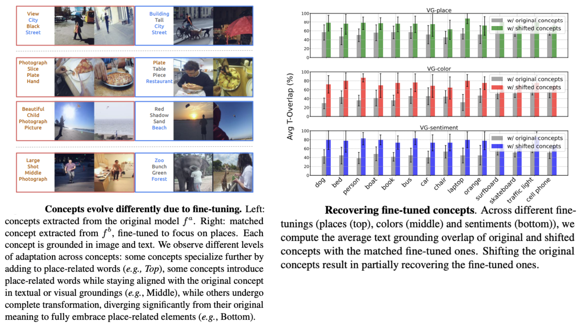

<!-- ---
title: "A Concept-Based Explainability Framework for Large Multimodal Models for Large Multimodal Models"
layout: project
permalink: /projects/lmm-explainability/
authors: Jayneel Parekh, Pegah Khayatan, Mustafa Shukor, Alasdair Newson, Matthieu Cord
affiliation: ISIR, Sorbonne Université, France
paper_url: https://arxiv.org/abs/2406.08074
code_url: https://github.com/mshukor/xl-vlms
# method_image: /assets/images/lmm-method.png
--- -->

<!-- ---
title: "A Concept-Based Explainability Framework for Large Multimodal Models"
permalink: /projects/lmm-explainability/
layout: default
--- -->

<!-- 

 -->

---

## Abstract

Multimodal LLMs (MLLMs) have reached remarkable levels of proficiency in understanding multimodal inputs. However, understanding and interpreting the behavior of such complex models is a challenging task, not to mention the dynamic shifts that may occur during fine-tuning, or due to covariate shift between datasets. In this work, we apply concept-level analysis towards MLLM understanding. More specifically, we propose to map hidden states to interpretable visual and textual concepts. This enables us to more efficiently compare certain semantic dynamics, such as the shift from an original and fine-tuned model, revealing concept alteration and potential biases that may occur during fine-tuning. We also demonstrate the use of shift vectors to capture these concepts changes. These shift vectors allow us to recover fine-tuned concepts by applying simple, computationally inexpensive additive concept shifts in the original model. Finally, our findings also have direct applications for MLLM steering, which can be used for model debiasing as well as enforcing safety in MLLM output. All in all, we propose a novel, training-free, ready-to-use framework for MLLM behavior interpretability and control. Code will be released publicly to facilitate reproducibility and future research.

---

## Evolution of concepts through fine-tuning

<!--  -->

Given a pretrained LMM for captioning and a target token (e.g., "Person"), we use the concept extraction method introduced in "A Concept-Based Explainability Framework
for Large Multimodal Models" ([paper page](https://jayneelparekh.github.io/LMM_Concept_Explainability/)) to study the shift of semantics due to fine-tuning. More specifically, we first extract concepts related to a specific token from the original and the fine-tuned models, and then try to understand how the original concepts have been shifted. 

Let's say $\mathbf{U}^a, \mathbf{U}^b \in \mathbb{R}^{D \times K}$ are $K$ concepts extracted from each model. We propose to characterize the concept changes from an original to fine-tuned model as linear directions in embedding space or *concept shift vectors*.
To do so, we first associate each original concept $\mathbf{u}^a_k \in \mathbf{U}^a$ with a subset of samples where $\mathbf{u}^a_k$ is the most activated concept:
$$
\mathbf{A}_{k} = \left\{ m \;\middle|\; k = \arg\max_{i} \left| \mathbf{v}^a_i(x_m) \right| \right\}.
$$
For each sample $x_m, \; m \in \mathbf{A}_k$, we define $\delta^{a \to b}_m = \mathbf{b}_m - \mathbf{a}_m$ as the change in its representation from $f^a$ to $f^b$.
To compute the concept shift vector $\mathbf{\Delta}_k^{a \to b}(\mathbf{u}^a_k)$ associated with $\mathbf{u}^a_k$, we aggregate shifts of its associated samples specified by $\mathbf{A}_k$:
$$
\mathbf{\Delta}_k^{a \to b}(\mathbf{u}^a_k) = \frac{1}{|\mathbf{A}_{k}|} \sum_{m \in \mathbf{A}_{k}} \delta^{a \to b}_m = \frac{1}{|\mathbf{A}_{k}|} \sum_{m \in \mathbf{A}_{k}} (\mathbf{b}_m - \mathbf{a}_m)
$$

The concept shift vector is used to shift each concept in the original model $\mathbf{u}^a_k$ to obtain the shifted concept $\mathbf{u}^s_k$:

$$
\mathbf{u}^s_k = \mathbf{u}^a_k + \alpha \cdot \mathbf{\Delta}_k^{a \to b}(\mathbf{u}^a_k),
$$


<!-- It is worth noting that given the concept shift vectors, the computation of shifted concepts does not rely on accessing the fine-tuned model. -->

<!-- 

 -->

{: width="600" }

### Our key insights ✨

1. **Different concept dynamics**  
   After fine-tuning, concepts from the original model don’t all behave the same way. Some become more specialized, others expand to include new elements related to fine-tuning, and a few vanish altogether — revealing the rich dynamics of concept evolution (*Figure 5*).

2. **Recovering the fine-tuned concepts 🔍**  
   We show it’s possible to reconstruct concepts from the fine-tuned model by simply applying shift vectors. With straightforward per-concept shifts derived from samples of both models, we can effectively “recover” how concepts have adapted (*Figure 6*).

3. **Aligned shifts = better recovery 🎯**  
   There’s a positive correlation between *shift consistency* — whether all shift vectors for a concept move in the same direction — and *concept recovery* — how closely the shifted original concept matches the fine-tuned one (*Figure 7*). 

<!-- {: width="800" } -->

---

## Concept evolution across datasets and applications to model steering

We analyze shifts between datasets using the same model to understand and steer model behavior without changing its weights. This framework compares representations from two datasets $S^{(1)}$ and $S^{(2)}$, enabling model steering — guiding outputs toward desired outcomes by modifying internal features rather than model parameters.

We perform **Coarse-grained** and **Fine-grained steering**. Coarse steering adjusts model outputs globally by computing a steering vector between average representations of a target set $\mathbf{B} = \{\mathbf{b}_1, \ldots, \mathbf{b}_N\}$ and an original set $\mathbf{A} = \{\mathbf{a}_1, \ldots, \mathbf{a}_M\}$ at layer $l$:

$$
\mathbf{s}_c = \frac{1}{N} \sum_{i=1}^N \mathbf{b}_i - \frac{1}{M} \sum_{i=1}^M \mathbf{a}_i
$$

This vector $\mathbf{s}_c$ is added to all sample activations $f_l(x_i)$ with a scaling factor $\alpha$:

$$
\tilde{f}_l(x_i) = f_l(x_i) + \alpha \mathbf{s}_c
$$

where $\alpha$ controls the steering strength (set to 1 by default).

Fine-grained steering targets specific concept-level adjustments by decomposing hidden states into concepts $\mathbf{U}$ and computing steering vectors between concepts $\mathbf{u}_i$ and $\mathbf{u}_j$:

$$
\mathbf{s}^f_{ij} = \mathbf{u}_j - \mathbf{u}_i
$$

Relevant steering vectors are identified through proximity matching or by their impact on steering model outputs toward specific answers or concepts. This fine-grained approach enables nuanced applications like debiasing or safety alignment.

{: width="600" }

### Our Key Insight ✨

We can efficiently steer an MLLM’s behavior at different levels of granularity without any fine-tuning. This includes broad adjustments that change the overall distribution of answers, as well as precise modifications that target specific responses. We explore these capabilities across a variety of tasks and datasets (*see examples of caption steering in the figure below*).
