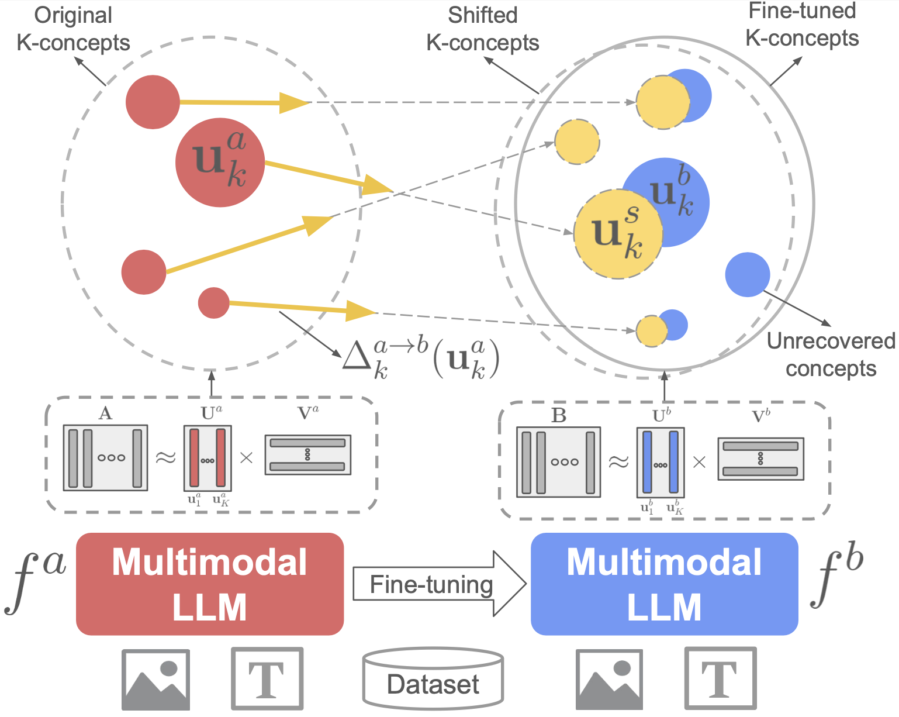
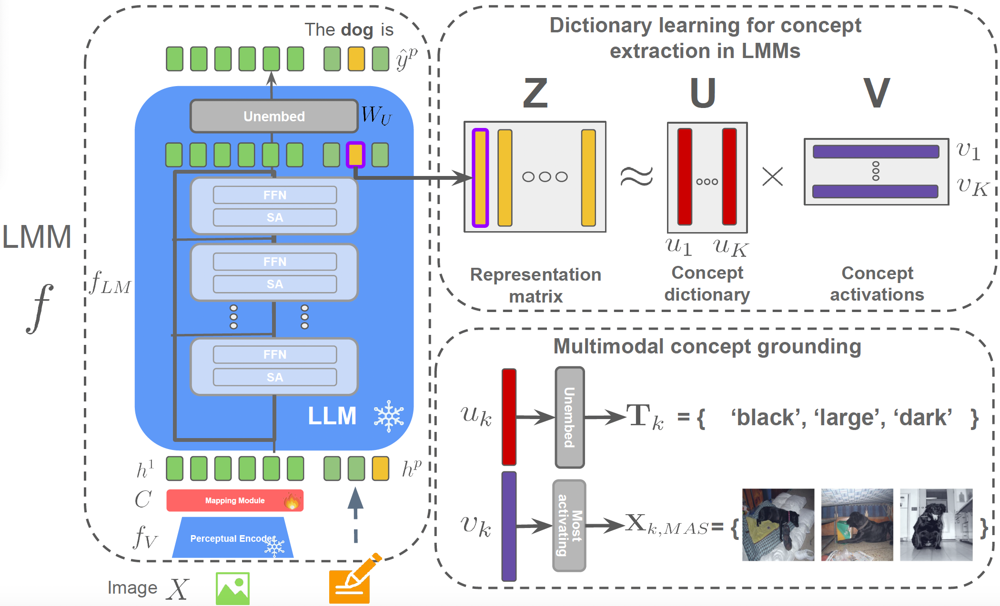



  

    

      
    

    

      
Analyzing Fine-tuning Representation Shift for Multimodal LLMs Steering alignment

      
Pegah Khayatan, Mustafa Shukor, Jayneel Parekh, Arnaud Dapogny, Matthieu Cord · ICCV 2025

      
We systematically analyze the evolution of hidden state representations to reveal how fine-tuning alters the internal structure of a model to specialize in new multimodal tasks. Using concept-based shift vectors, we can recover fine-tuned concepts and steer model behaviors without any training.

      

        <a class="proj-btn" href="https://arxiv.org/pdf/2501.03012" target="_blank">Paper</a>
        <a class="proj-btn" href="https://github.com/mshukor/xl-vlms" target="_blank">Code</a>
      

    

  

  

    

      
    

    

      
A Concept-Based Explainability Framework for Large Multimodal Models

      
Jayneel Parekh, Pegah Khayatan, Mustafa Shukor, Alasdair Newson, Matthieu Cord · NeurIPS 2024

      
A novel framework for interpreting large multimodal models using dictionary learning applied to token representations. The learned dictionary elements correspond to well-grounded multimodal concepts, evaluated for disentanglement and visual-textual grounding quality.

      

        <a class="proj-btn" href="https://arxiv.org/abs/2406.08074" target="_blank">Paper</a>
        <a class="proj-btn" href="https://github.com/mshukor/xl-vlms" target="_blank">Code</a>
      

    

  

  

    

      
    

    

      
Adversarial Corner Case Generation for Motion Planning

      
Pegah Khayatan, et al.

      
A framework to stress-test vehicle planners by generating safety-critical driving scenarios using the nuPlan simulator, exposing potential collision risks. Adapted from Han et al. 2022 to support a wider range of agents and behaviors.

      

        <a class="proj-btn" href="https://github.com/pegah-kh/kinematic_adversary_agents/blob/main/report.pdf" target="_blank">Report</a>
        <a class="proj-btn" href="https://github.com/pegah-kh/kinematic_adversary_agents" target="_blank">Code</a>
      

    

  

  

    

      
    

    

      
Simplified Velocity Skinning

      
Pegah Khayatan

      
A course project making animations more realistic by adding exaggerated deformation triggered by skeletal velocity on top of standard skinning. Built using a CGP library and based on a simplification of the Velocity Skinning paper.

      

        <a class="proj-btn" href="https://github.com/pegah-kh/Simple-Velocity-Skinning" target="_blank">Code</a>
        <a class="proj-btn" href="https://github.com/pegah-kh/Simple-Velocity-Skinning/tree/master/report_and_demonstration" target="_blank">Report</a>
      

    

  

  

    

      
    

    

      
Landmark Localization for a Fashion Dataset: A PIFPAF Plugin

      
Pegah Khayatan

      
An OpenPifPaf plugin for detecting key landmarks — such as sleeve ends in shirts — across various clothing items in a fashion dataset.

      

        <a class="proj-btn" href="https://github.com/pegah-kh/pifpaf_deepfashion" target="_blank">Code</a>
      

    

  

