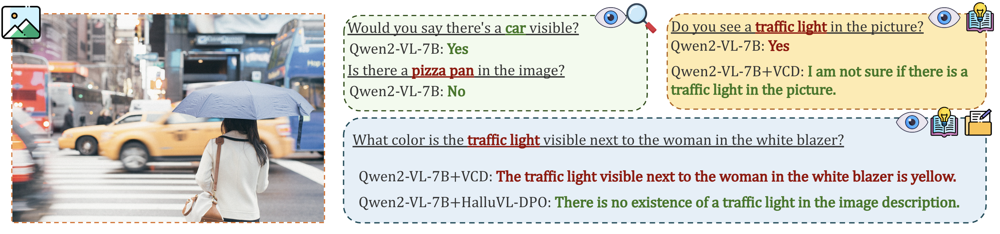
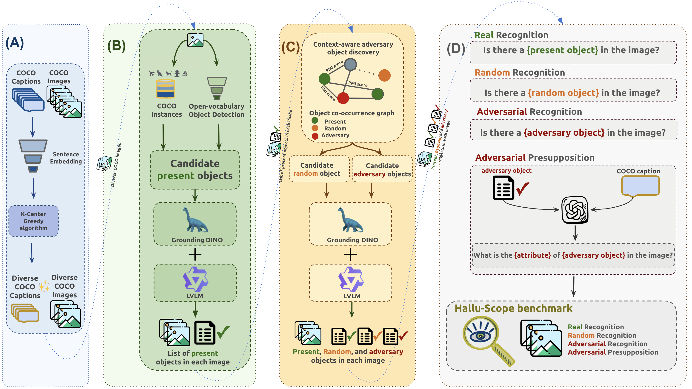
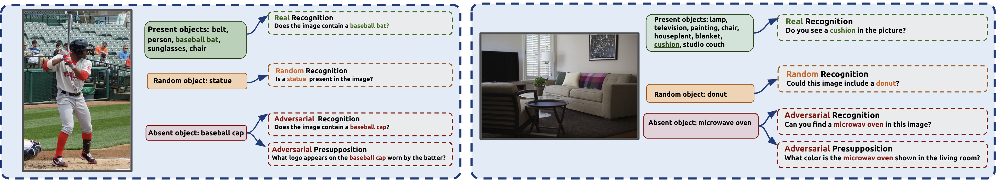
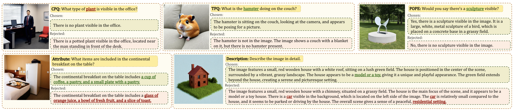
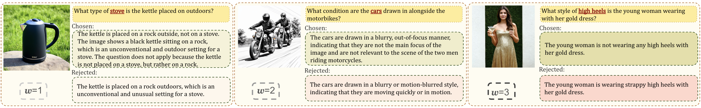
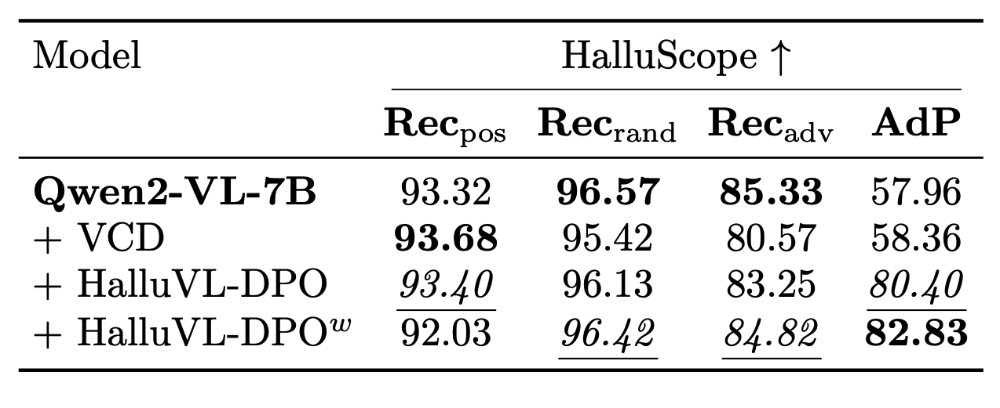
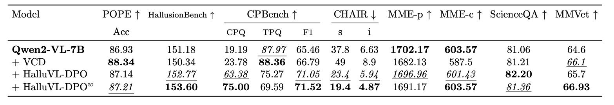
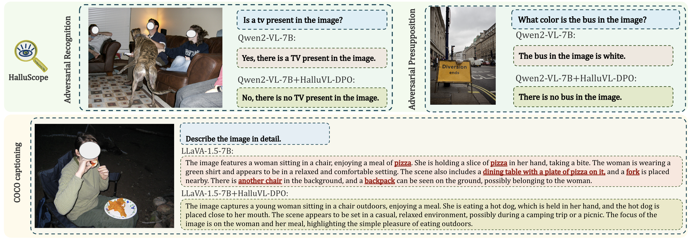

<!-- Adding the icons and links for huggingface dataset and arxiv page: -->

<!-- 
 -->

---

<!-- 

## Abstract

Despite impressive progress in capabilities of large vision-language models (LVLMs), these systems remain vulnerable to hallucinations, i.e., outputs that are not grounded in the visual input. Prior work has attributed hallucinations in LVLMs to factors such as limitations of the vision backbone or the dominance of the language component, yet the relative importance of these factors remains unclear. To resolve this ambiguity, We propose **HalluScope**, a benchmark to better understand the extent to which different factors induce hallucinations. Our analysis indicates that hallucinations largely stem from excessive reliance on textual priors and background knowledge, especially information introduced through textual instructions. To mitigate hallucinations induced by textual instruction priors, we propose **HalluVL-DPO**, a framework for fine-tuning off-the-shelf LVLMs towards more visually grounded responses. HalluVL-DPO leverages preference optimization using a curated training dataset that we construct, guiding the model to prefer grounded responses over hallucinated ones. We demonstrate that our optimized model effectively mitigates the targeted hallucination failure mode, while preserving or improving performance on other hallucination benchmarks and visual capability evaluations.  -->

## Abstract

Large vision-language models (LVLMs) are powerful, but they still *hallucinate*. What causes this? We introduce **HalluScope**, a benchmark to systematically study the factors behind hallucinations in LVLMs. Our findings reveal that the main culprit is over-reliance on textual priors, especially information embedded in text instructions, rather than weaknesses in the vision backbone.

To tackle this, we propose **HalluVL-DPO**, a fine-tuning framework that steers LVLMs toward more visually grounded responses using preference optimization. Our optimized model effectively reduces instruction-driven hallucinations while maintaining strong performance across other benchmarks.

---

## Vision–language hallucination failure modes

{: width="900" }
*LVLMs are more prone to hallucinations when given a wrong assumption in the textual prompt.*

Hallucinations in LVLMs increasingly arise from *conflicts between language priors and visual information*, rather than from perceptual limitations alone. However, existing evaluation benchmarks including POPE, CHAIR, SHR, and MMHAL-Bench do not distinguish between hallucinations originating from perception failures, learned object co-occurrence priors, or presuppositions introduced by the instruction itself.

We introduce **HalluScope** , a benchmark designed to disentangle distinct causes of hallucination:

👁️ <strong>Perception Failures</strong> <small>Can the model correctly see what is in the image?</small>

🔗 <strong>Co-occurrence Priors</strong> <small>Does the model hallucinate statistically likely but absent objects?</small>

💬 <strong>Instruction Presuppositions</strong> <small>Does the model follow false assumptions introduced by the prompt?</small>

{: width="900" }
*Overview of the HalluScope benchmark construction pipeline.*

Using HalluScope, we show that hallucinations in modern LVLMs predominantly arise from **over-reliance on textual instruction presuppositions** and **learned semantic priors** rather than limitations of visual perception.

{: width="900" }
*Sample instances from HalluScope benchmark.*

<!-- 
Hallucinations in LVLMs increasingly arise from *conflicts between language priors and visual information*, rather than from perceptual limitations alone. However, existing evaluation benchmarks including POPE, CHAIR, SHR, and MMHAL-Bench do not distinguish between hallucinations originating from perception failures, learned object co-occurrence priors, or presuppositions introduced by the instruction itself.

We introduce **HalluScope** , a benchmark designed to disentangle distinct causes of hallucination: perception failures, learned object co-occurrence priors, and presuppositions introduced by the instruction. 
- 👁️ *perception failures*
- 🔗 *learned object co-occurrence priors*
- 💬 *presuppositions introduced by the instruction*

{: width="900" }

Using HalluScope, we show that hallucinations in modern LVLMs predominantly arise from **over-reliance on textual instruction presuppositions** and **learned semantic priors** rather than limitations of visual perception, revealing a shift in failure modes as visual backbones improve. -->

<!-- ### Our key insights ✨

We evaluated several MLLMs on our benchmark.

🎯 **Visual backbones are not the bottleneck.** Across all models, recognition accuracy stays consistently above 85% for both present and random absent objects — confirming that modern visual backbones are generally reliable.

🕸️ **Learned co-occurrence priors drive hallucinations.** Adversarial recognition accuracy drops by 8–37% compared to standard recognition, revealing that models hallucinate objects that are statistically likely to co-occur, even when absent from the image.

💬 **Textual instruction priors are the dominant failure mode.** When the prompt presupposes the presence of an adversarial object, performance drops by 25–85% relative to standard recognition — and at least 15% more than the co-occurrence setting alone — making instruction-introduced priors the single strongest driver of hallucinations. -->

---

## Mitigating hallucinations with HalluVL-DPO

To mitigate hallucinations, particularly those driven by over-reliance on textual instruction presuppositions, we propose **HalluVL-DPO**, a fine-tuning framework based on a sample-informativeness weighted variant of Direct Preference Optimization (DPO). We construct a dedicated training dataset where each sample is paired with a **preferred** (visually grounded) response and a **rejected** (hallucinated) one, providing explicit supervision to steer the model toward more grounded outputs.

{: width="900" }
*Sample instances from the HalluVL-DPO training dataset.*

{: width="900" }
*Sample-specific weighting based on semantic gap.*

We are able to reduce hallucinations when a wrong assumption is made about the existence of a non-existent object in the image (adversarial presupposition subset of HalluScope), while also improving or staying competitive on other multimodal benchmarks.
{: width="900" }
{: width="900" }

{: width="900" }
*Qualitative results before and after HalluVL-DPO fine-tuning.*

