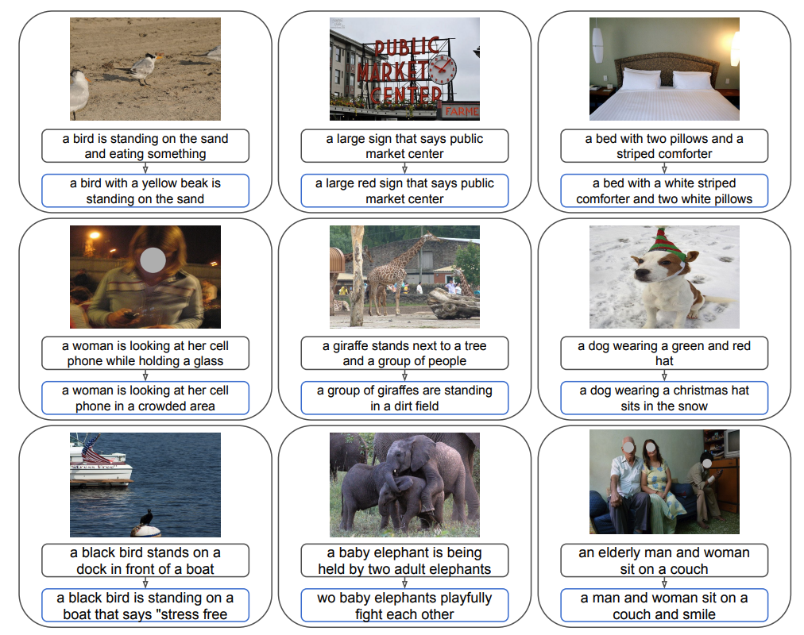

<!-- ---
title: "A Concept-Based Explainability Framework for Large Multimodal Models for Large Multimodal Models"
layout: project
permalink: /projects/lmm-explainability/
authors: Jayneel Parekh, Pegah Khayatan, Mustafa Shukor, Alasdair Newson, Matthieu Cord
affiliation: ISIR, Sorbonne Université, France
paper_url: https://arxiv.org/abs/2406.08074
code_url: https://github.com/mshukor/xl-vlms
# method_image: /assets/images/lmm-method.png
--- -->

<!-- ---
title: "A Concept-Based Explainability Framework for Large Multimodal Models"
permalink: /projects/lmm-explainability/
layout: default
--- -->

<!-- 

 -->

---

## Abstract

Despite impressive progress in capabilities of large vision-language models (LVLMs), these systems remain vulnerable to hallucinations, i.e., outputs that are not grounded in the visual input. Prior work has attributed hallucinations in LVLMs to factors such as limitations of the vision backbone or the dominance of the language component, yet the relative importance of these factors remains unclear. To resolve this ambiguity, We propose **HalluScope**, a benchmark to better understand the extent to which different factors induce hallucinations. Our analysis indicates that hallucinations largely stem from excessive reliance on textual priors and background knowledge, especially information introduced through textual instructions. To mitigate hallucinations induced by textual instruction priors, we propose **HalluVL-DPO**, a framework for fine-tuning off-the-shelf LVLMs towards more visually grounded responses. HalluVL-DPO leverages preference optimization using a curated training dataset that we construct, guiding the model to prefer grounded responses over hallucinated ones. We demonstrate that our optimized model effectively mitigates the targeted hallucination failure mode, while preserving or improving performance on other hallucination benchmarks and visual capability evaluations. 

---

## Vision–language hallucination failure modes 

{: width="900" }

As visual backbones improve, hallucinations increasingly arise from *conflicts between language priors and visual information*, rather than from perceptual limitations alone. However, existing evaluation benchmarks including POPE, CHAIR, SHR, and MMHAL-Bench do not distinguish between hallucinations originating from perception failures, learned object co-occurrence priors, or presuppositions introduced by the instruction itself.

We introduce **HalluScope** , a benchmark designed to disentangle distinct causes of hallucination: perception failures, learned object co-occurrence priors, and presuppositions introduced by the instruction. Using HalluScope, we show that hallucinations in modern LVLMs predominantly arise from over-reliance on textual instruction presuppositions and learned semantic priors rather than limitations of visual perception, revealing a shift in failure modes as visual backbones improve.

Each image in our benchmark is paired with three targeted questions. Our construction pipeline proceeds as follows:

🖼️ **A. Image Sampling** — Diverse samples are drawn from a source image collection

🔍 **B. Object Detection** — Objects are detected and localized in each image

🕸️ **C.** An object co-occurrence graph is built to surface context-aware adversarial objects — plausible but absent from the image

❓ **D. Question Generation** — Three targeted questions are crafted per image, probing:
- 👁️ *Visual perception*
- 🔗 *Reliance on learned co-occurrence patterns*
- 💬 *Sensitivity to presuppositions in the textual instruction*

{: width="900" }

### Our key insights ✨

We evaluated several MLLMs on our benchmark.

🎯 **Visual backbones are not the bottleneck.** Across all models, recognition accuracy stays consistently above 85% for both present and random absent objects — confirming that modern visual backbones are generally reliable.

🕸️ **Learned co-occurrence priors drive hallucinations.** Adversarial recognition accuracy drops by 8–37% compared to standard recognition, revealing that models hallucinate objects that are statistically likely to co-occur, even when absent from the image.

💬 **Textual instruction priors are the dominant failure mode.** When the prompt presupposes the presence of an adversarial object, performance drops by 25–85% relative to standard recognition — and at least 15% more than the co-occurrence setting alone — making instruction-introduced priors the single strongest driver of hallucinations.

---

## Mitigating hallucinations with HalluVL-DPO

To mitigate hallucinations, particularly those driven by over-reliance on textual instruction presuppositions, we propose **HalluVL-DPO**, a fine-tuning framework based on a sample-informativeness weighted variant of Direct Preference Optimization (DPO). We construct a dedicated training dataset where each sample is paired with a **preferred** (visually grounded) response and a **rejected** (hallucinated) one, providing explicit supervision to steer the model toward more grounded outputs.

<figure>
  
  <figcaption>Sample instances from the HalluVL-DPO training dataset.</figcaption>
</figure>

<figure>
  
  <figcaption>Sample-specific weighting based on semantic gap.</figcaption>
</figure>
<!-- 
We analyze shifts between datasets using the same model to understand and steer model behavior without changing its weights. This framework compares representations from two datasets $S^{(1)}$ and $S^{(2)}$, enabling model steering — guiding outputs toward desired outcomes by modifying internal features rather than model parameters.

We perform **Coarse-grained** and **Fine-grained steering**. Coarse steering adjusts model outputs globally by computing a steering vector between average representations of a target set $\mathbf{B} = \{\mathbf{b}_1, \ldots, \mathbf{b}_N\}$ and an original set $\mathbf{A} = \{\mathbf{a}_1, \ldots, \mathbf{a}_M\}$ at layer $l$:

$$
\mathbf{s}_c = \frac{1}{N} \sum_{i=1}^N \mathbf{b}_i - \frac{1}{M} \sum_{i=1}^M \mathbf{a}_i
$$

This vector $\mathbf{s}_c$ is added to all sample activations $f_l(x_i)$ with a scaling factor $\alpha$:

$$
\tilde{f}_l(x_i) = f_l(x_i) + \alpha \mathbf{s}_c
$$

where $\alpha$ controls the steering strength (set to 1 by default).

Fine-grained steering targets specific concept-level adjustments by decomposing hidden states into concepts $\mathbf{U}$ and computing steering vectors between concepts $\mathbf{u}_i$ and $\mathbf{u}_j$:

$$
\mathbf{s}^f_{ij} = \mathbf{u}_j - \mathbf{u}_i
$$

Relevant steering vectors are identified through proximity matching or by their impact on steering model outputs toward specific answers or concepts. This fine-grained approach enables nuanced applications like debiasing or safety alignment.

{: width="600" }

### Our Key Insight ✨

We can efficiently steer an MLLM’s behavior at different levels of granularity without any fine-tuning. This includes broad adjustments that change the overall distribution of answers, as well as precise modifications that target specific responses. We explore these capabilities across a variety of tasks and datasets (*see examples of caption steering in the figure below*). --> -->
